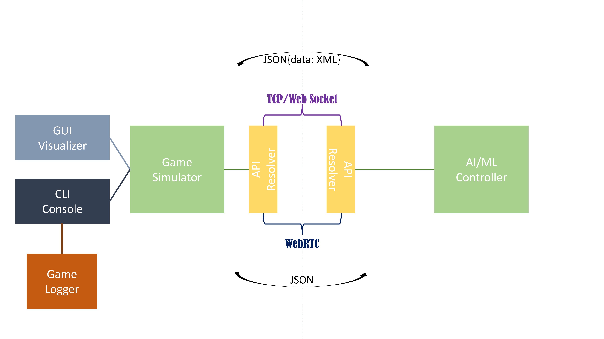
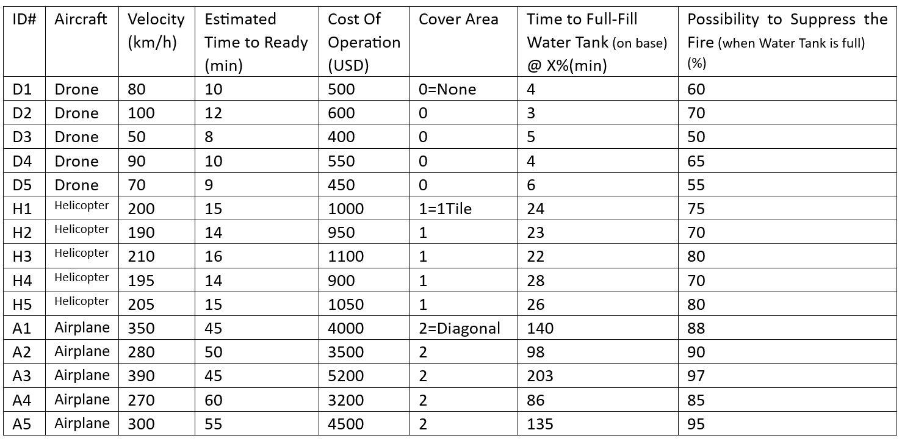
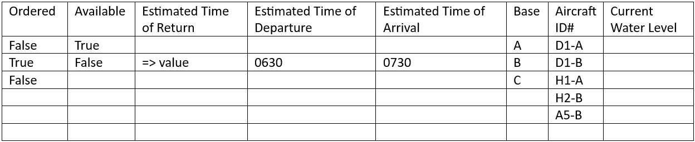
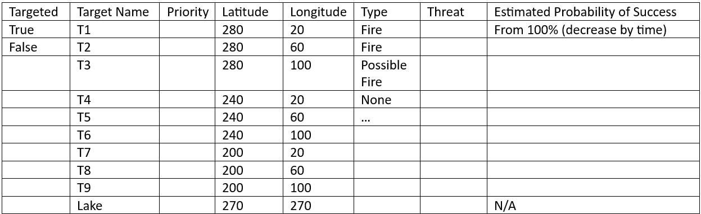
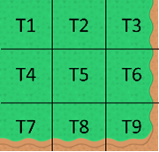
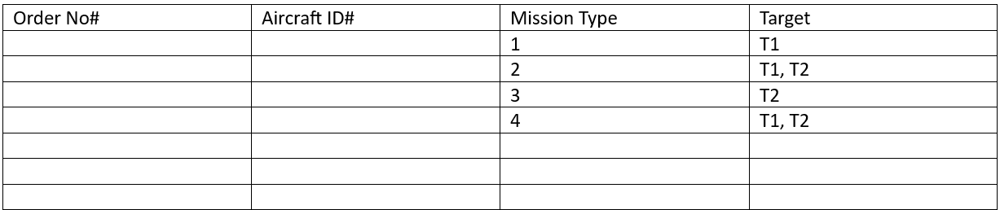
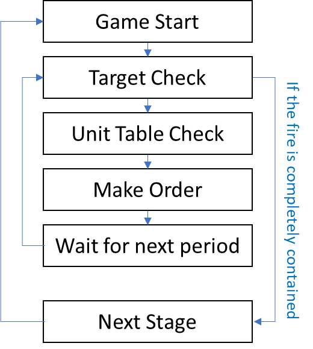
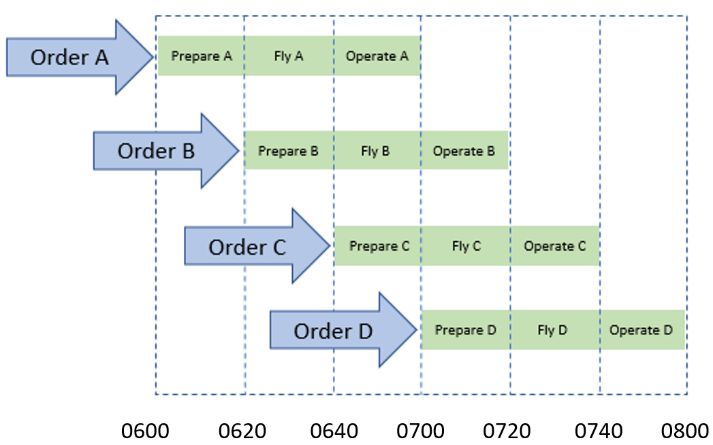

# OperationSimulator
<pre>DESC: Operation Simulation Game for AI/ML Learning</pre>


## **1. Overall Explanation**
### **A. FOS**
- The Fire Operational order Simulator game interface (FOS) is a program that allows the development of an AI system that can provide operational orders for suppressing fire in a simulated environment.

### **B. Internal Architecture**

#### i. AI/ML Controller: AI sample solution that can solve the game of the simulator.
#### ii. API Resolver: Layer that abstracts the user-selected API method such as HTTP, TCP Socket and Named Pipe(optional)
#### iii. Game Simulator: Fire Disaster Simulator which get input from API Resolver, calculate current status, and creates data that can be used to visualize game. For game visualization, the game simulation code should be completely abstracted and operate without problems in both the GUI and CLI environments.
#### iv. GUI Visualizer/CLI Console: It can be both a GUI window and a CLI console according to the interface mode settings that the user selects.
#### v. (DEPRECATED) Game Logger: Game Tracker/Logger that records the game progress in detail. (Required to discuss the need for real-time data transmission later)

### **C. Interface**
- The **Game Screen** has a resolution of 300 by 300. On the upper-left corner is the fire area, where the fire randomly occurs. The starting point is stationary at the lower-right corner of the screen, while a lake is located at the upper-right corner.
- The **Controller** is where the operation orders are made. It is internally connected to the Game screen so the result can be visually showed there. 

### **D. Aircraft**
- The program features five types of drones, helicopters, and airplanes, each with unique properties such as cost, velocity, and the ability to suppress fire.
- To avoid obvious aircraft selection options, the properties of each aircraft are adjusted to have pros and cons relatively.
- When each round starts, every aircraft gets a random value of water filled. After the aircraft returns from an operation the value is 0, and the value increases as times passes according to a formula. Once an order is made again, the water filling process stops and preparing time will begin.

### **E. Fire Area**
<pre>Fires randomly occur on the 3 by 3 square located
 in the upper-left corner of the Game Screen.
Each portion of the square has its own coordinates.</pre>

### **F. Round**
<pre>The program has three rounds.
The first round has one fire randomly generated on the 3 by 3 square.
The second round has two, and the third round has three fires randomly generated.</pre>

### **G. Review Criteria**
> The best AI system will be determined based on its performance in terms of the least amount of time and cost required to suppress the fires in each round.

```Total Score: (ex) time^2 + log(cost) [less is better]```
___

## **2. Data Tables**
### **A. Aircraft Spec Sheet**


### **B. Unit Table**


### **C. Target List**


- As time goes on, estimated probability of suppression of each target is going to lower.
- Level of threat will be randomly selected at the beginning of each play and represent possibility of spreading of fire. And ‘Priority’ comes from the level of Threat.

### **D. Operation Order**

<pre>Mission Type:
[1] Direct to LOCATION
[2] Indirect to LOCATION
[3] Water Fill from Lake and [1]
[4] Water Fill from Lake and [2]</pre>
***_Drone only can be type 1*
___

## **3.	Flow Chart**

___

## **4. Order Sequence**
- i. Each order consists of route, type of aircraft to use based on their properties and whether to fill the aircraft’s water tank from the lake or fly directly to the fire.
- ii. An order is made every specific(20min) period. Even though the order made on the previous period is on process, a new order will be made.

- iii. Once an order is made, the aircraft cannot be controlled anymore before the operation ends. (Available after ETR of each aircraft)
___

## **5. Application Programming Interface between Game Simulator and AI Controller**
* support No GUI mode

### **API Preferences**
<pre>** Client Side API **
/start
/data/aircraft_specsheet
/data/target_list
/data/unit_table
/order/< XML >  => after validating the XML send 200 or 403 or etcs
/result
/disconnect
</pre>
<pre>** Server Side API **
/disconnect
</pre>
___

## **6. Folder Structure**
<pre>
> config : contains the configuration json files
> etc : contains the files that doesn't related with the codes
> res : contains image resource files be used at the visualizer
> src : source directory
    > controller : controller source dir

    > simulator : simulator source dir
        > api : api source dir
        > display : sources for visualization
        > round : sources that consists the game scenarios
        > unit : data units
    > test : test source dir (unit tests, etcs)
build.py : pyinstaller build script
main.py : pygbag main script for web browsers
run.py : runnable main script for desktop environment
</pre>